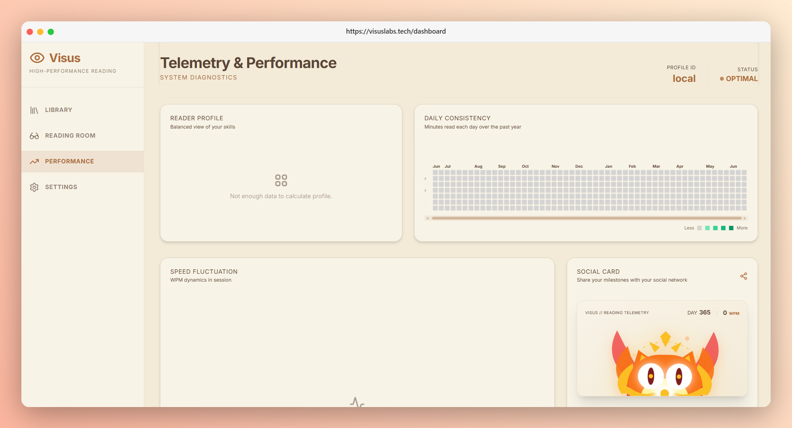

# Visus 👁️

### Simple & powerful speed-reading platform for web & PWA

[](https://nextjs.org/)
[](https://www.typescriptlang.org/)
[](https://tailwindcss.com/)
[](https://web.dev/progressive-web-apps/)
[](https://opensource.org/licenses/MIT)




Visus is a speed-reading web application and Progressive Web App (PWA) designed to help you read faster and train your vision. It supports RSVP (word-by-word) and Cluster (grouping words) reading modes, runs completely offline, and respects your privacy by keeping your texts in your browser.

---

## 🌟 Core features

<details>
<summary><b>📖 Dual reading modes</b> (Click to expand)</summary>

* **RSVP Mode**: Displays words one-by-one in a fixed position. It highlights the Optimal Recognition Point (ORP) in each word so your eyes do not have to move.
* **Cluster Mode**: Groups words into small chunks (2 to 5 words) so you can read phrases at a glance and expand your peripheral vision.

</details>

<details>
<summary><b>⚡ Fast & practical customizations</b> (Click to expand)</summary>

* **Adjustable speed**: Change reading speeds easily from 100 to 1200 Words Per Minute (WPM).
* **Reading themes**: Comfortable color presets including Light (Paper), Sepia, Nordic, and Dark modes.
* **Smart pauses**: Automatically adds minor delays at punctuation marks (like periods and commas) to make reading feel natural.

</details>

---

## 🗺️ Project structure

Clean and modular directory structure:

```text
visus/
├── .github/                      # GitHub issue and PR templates
├── public/                       # Static assets, manifest, and service worker for PWA
├── src/
│   ├── app/                      # Next.js App Router (Layouts & Pages)
│   │   ├── dashboard/            # Reading analytics page
│   │   ├── library/              # Upload and book list page
│   │   ├── reader/               # RSVP & Cluster reader page
│   │   └── settings/             # Font and speed settings page
│   ├── components/               # Reusable UI components (like the Sidebar)
│   ├── context/                  # Global react contexts
│   ├── core/                     # Core reading algorithms (RSVP & chunking)
│   ├── hooks/                    # Reusable React hooks
│   └── lib/                      # Helper utilities and file parsers
├── components.json               # Shadcn UI path setup
├── package.json                  # Dependencies list
└── tsconfig.json                 # TypeScript compiler setup
```

---

## 🚀 Quick start

### Prerequisites

* **Node.js**: Version >= `18.x`
* **NPM** or **pnpm**
* **Git**

### 1. Clone & setup

```bash
git clone https://github.com/Doritozz05/Visus.git
cd visus
```

### 2. Install packages

```bash
npm install
```

### 3. Run development server

```bash
npm run dev
```

Open [http://localhost:3000](http://localhost:3000) on your browser.

### 4. Build PWA

```bash
npm run build
```

---

## 📱 Offline & mobile testing

To test PWA offline and mobile installations locally without a domain:

| Platform                           | URL                             | Note                                                      |
| :--------------------------------- | :------------------------------ | :-------------------------------------------------------- |
| **Desktop PC**               | `http://localhost:3000`       | Works offline out of the box in Chrome/Firefox/Safari.    |
| **Mobile Browser**           | `http://<your-local-ip>:3000` | Expose server using `npx next dev --hostname 0.0.0.0`   |
| **Mobile App (iOS/Android)** | `https://xxxx.ngrok-free.app` | Run `npx ngrok http 3000` to create a secure test link. |
